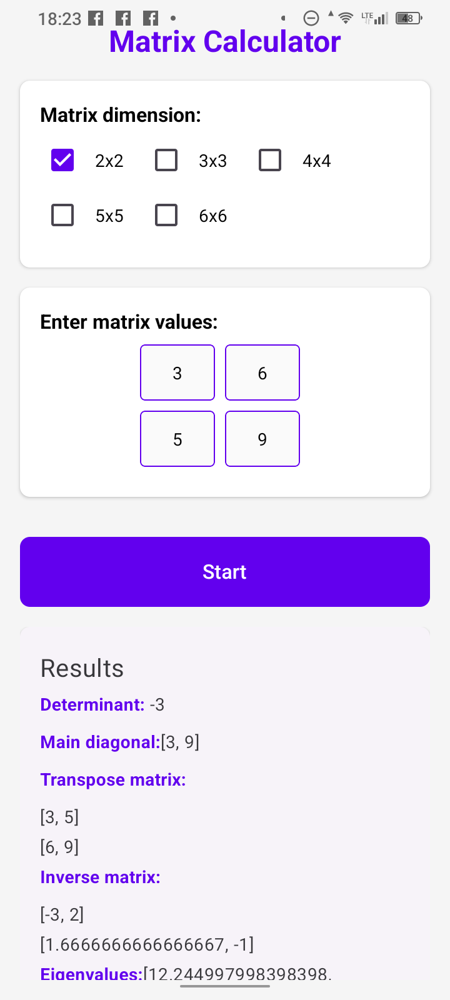

# MatrixCalc
Android App for Matrix Calculation

1) Features
   
   Determinan
   
   Main diagonal
   
   Transpose matrix
   
   Inverse matrix
   
   Eigenvalues
   
3) Screenshots
   

5) Installation
   
git clone https://github.com/GeoTuxMan/MatrixCalc.github

cd MatrixCalc

npm install

npm install -g expo-cli

7) Running the App
   
npx expo start

9) Testing on Physical Decice
    
Install Expo Go from App Store (iOS) or Google Play (Android)

Start the development server: npx expo start

Scan the QR code with Expo Go app

6) Building the app (.apk)
   
npm install -g eas-cli

expo install --check

eas build -p android --profile preview

Download apk file from expo.dev
